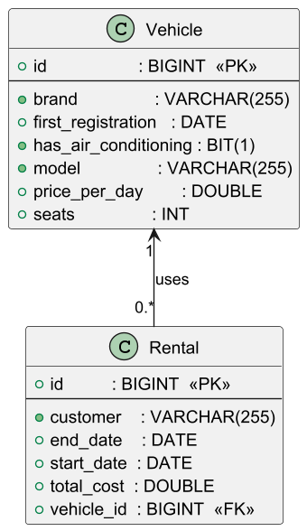
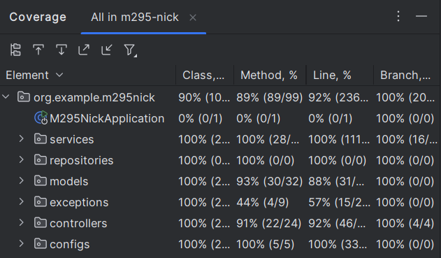

# M295-Nick (Car Rental Management System)

## 1. Projektbeschreibung
Dieses Projekt ist eine REST-API auf Basis von Spring Boot zur Verwaltung eines Fahrzeugvermietungssystems.

Folgende Funktionen sind enthalten:

- CRUD-Operationen für **Vehicle** (Fahrzeuge) und **Rental** (Mietvorgänge).
- Filtermöglichkeiten für Fahrzeuge nach Marke, Sitzplätzen oder Klimaanlage.
- Filtermöglichkeiten für Mietvorgänge nach Start- bzw. Enddatum.
- Benutzer-Authentifizierung via HTTP Basic mit zwei Rollen:
  - **USER** (nur Lesezugriff)
  - **ADMIN** (volle Rechte)
- Zentrales Exception-Handling über einen globalen ExceptionHandler.
- Bean-Validation für Entitätsfelder (z.B. Wertebereiche, Datumsregeln).

---

## 2. Visualisierung

### 2.1 Datenbankdiagramm
Das Datenbankschema besteht aus zwei Tabellen mit folgender Struktur:

- **vehicle.id** ist Primärschlüssel.
- **rental.id** ist Primärschlüssel, **rental.vehicle_id** ist Fremdschlüssel zu **vehicle.id**.
- Beziehung: Ein Fahrzeug (Vehicle) kann 0 bis viele Mietvorgänge (Rental) haben (1:n).


### 2.2 Klassendiagramm


### 2.3 Screenshot Testdurchführung


---

## 3. Validierungsregeln (Bean Validation)

### 3.1 Vehicle (Fahrzeug)

| Feld               | Regeln                              |
|--------------------|-----------------------------------|
| brand              | nicht leer, max. 50 Zeichen        |
| model              | nicht leer, max. 50 Zeichen        |
| firstRegistration  | nicht null, darf nicht in Zukunft sein |
| hasAirConditioning  | nicht null                        |
| pricePerDay        | nicht null, > 0                   |
| seats              | nicht null, zwischen 1 und 9 inkl.|

### 3.2 Rental (Mietvorgang)

| Feld       | Regeln                                           |
|------------|-------------------------------------------------|
| customer   | nicht leer, max. 100 Zeichen                      |
| startDate  | nicht null, heute oder in der Zukunft             |
| endDate    | nicht null, in der Zukunft, muss > startDate sein |
| totalCost  | nicht null, > 0                                  |
| vehicle    | nicht null, jede Buchung bezieht sich auf genau ein Fahrzeug |

---

## 4. Berechtigungsmatrix

| Endpoint                       | HTTP-Methode | Rolle USER erlaubt? | Rolle ADMIN erlaubt? |
|-------------------------------|--------------|--------------------|---------------------|
| /api/v1/vehicles              | GET          | Ja                 | Ja                  |
| /api/v1/vehicles/{id}         | GET          | Ja                 | Ja                  |
| /api/v1/vehicles              | POST         | Nein               | Ja                  |
| /api/v1/vehicles/{id}         | PUT          | Nein               | Ja                  |
| /api/v1/vehicles/{id}         | DELETE       | Nein               | Ja                  |
| /api/v1/vehicles/filter/ac    | GET          | Ja                 | Ja                  |
| /api/v1/vehicles/filter/brand | GET          | Ja                 | Ja                  |
| /api/v1/vehicles/filter/seats | GET          | Ja                 | Ja                  |

| Endpoint                       | HTTP-Methode | Rolle USER erlaubt? | Rolle ADMIN erlaubt? |
|-------------------------------|--------------|--------------------|---------------------|
| /api/v1/rentals               | GET          | Ja                 | Ja                  |
| /api/v1/rentals/{id}          | GET          | Ja                 | Ja                  |
| /api/v1/rentals               | POST         | Nein               | Ja                  |
| /api/v1/rentals/{id}          | PUT          | Nein               | Ja                  |
| /api/v1/rentals/{id}          | DELETE       | Nein               | Ja                  |
| /api/v1/rentals/filter/start  | GET          | Ja                 | Ja                  |
| /api/v1/rentals/filter/end    | GET          | Ja                 | Ja                  |

- **USER**: Nur Lesezugriff (GET).
- **ADMIN**: Volle CRUD-Rechte.

---

## 5. OpenAPI-Dokumentation (Auszug)

Die API-Dokumentation ist über `/v3/api-docs` (JSON) und `/swagger-ui.html` bzw. `/swagger-ui/index.html` (UI) verfügbar (vorausgesetzt OpenAPIConfig ist aktiviert).

### Beispiel Vehicle Endpoints

- **GET /api/v1/vehicles**  
  Listet alle Fahrzeuge auf.  
  Zugriff: USER, ADMIN

- **GET /api/v1/vehicles/{id}**  
  Ein Fahrzeug per ID abrufen.  
  Zugriff: USER, ADMIN

- **POST /api/v1/vehicles**  
  Neues Fahrzeug anlegen.  
  Zugriff: ADMIN

- **PUT /api/v1/vehicles/{id}**  
  Fahrzeug aktualisieren.  
  Zugriff: ADMIN

- **DELETE /api/v1/vehicles/{id}**  
  Fahrzeug löschen.  
  Zugriff: ADMIN

- **GET /api/v1/vehicles/filter/ac?hasAirConditioning={true|false}**  
  Fahrzeuge nach Klimaanlage filtern.  
  Zugriff: USER, ADMIN

- **GET /api/v1/vehicles/filter/brand?brand={substring}**  
  Fahrzeuge nach Marken-Substring filtern.  
  Zugriff: USER, ADMIN

- **GET /api/v1/vehicles/filter/seats?maxSeats={anzahl}**  
  Fahrzeuge mit maximaler Sitzplatzanzahl.  
  Zugriff: USER, ADMIN

### Beispiel Rental Endpoints

- **GET /api/v1/rentals**  
  Alle Mietvorgänge auflisten.  
  Zugriff: USER, ADMIN

- **GET /api/v1/rentals/{id}**  
  Mietvorgang per ID abrufen.  
  Zugriff: USER, ADMIN

- **POST /api/v1/rentals**  
  Neuen Mietvorgang anlegen.  
  Zugriff: ADMIN

- **PUT /api/v1/rentals/{id}**  
  Mietvorgang aktualisieren.  
  Zugriff: ADMIN

- **DELETE /api/v1/rentals/{id}**  
  Mietvorgang löschen.  
  Zugriff: ADMIN

- **GET /api/v1/rentals/filter/start?date={yyyy-MM-dd}**  
  Mietvorgänge mit Startdatum nach dem angegebenen Datum.  
  Zugriff: USER, ADMIN

- **GET /api/v1/rentals/filter/end?date={yyyy-MM-dd}**  
  Mietvorgänge mit Enddatum vor dem angegebenen Datum.  
  Zugriff: USER, ADMIN

---

## 6. Berechtigungsübersicht (detailliert)

| Ressource                   | GET USER | GET ADMIN | POST ADMIN | PUT ADMIN | DELETE ADMIN |
|----------------------------|----------|-----------|------------|-----------|--------------|
| /api/v1/vehicles            | ✓        | ✓         | ✗          | ✗         | ✗            |
| /api/v1/vehicles/{id}       | ✓        | ✓         | ✗          | ✗         | ✗            |
| /api/v1/vehicles (Body)     | ✗        | ✓         | ✓          | ✗         | ✗            |
| /api/v1/vehicles/{id} (Body)| ✗        | ✓         | ✗          | ✓         | ✗            |
| /api/v1/vehicles/{id}       | ✗        | ✓         | ✗          | ✗         | ✓            |
| /api/v1/vehicles/filter/ac  | ✓        | ✓         | ✗          | ✗         | ✗            |
| /api/v1/rentals             | ✓        | ✓         | ✗          | ✗         | ✗            |
| /api/v1/rentals/{id}        | ✓        | ✓         | ✗          | ✗         | ✗            |
| /api/v1/rentals (Body)      | ✗        | ✓         | ✓          | ✗         | ✗            |
| /api/v1/rentals/{id} (Body) | ✗        | ✓         | ✗          | ✓         | ✗            |
| /api/v1/rentals/{id}        | ✗        | ✓         | ✗          | ✗         | ✓            |
| /api/v1/rentals/filter/start| ✓        | ✓         | ✗          | ✗         | ✗            |

✓ = erlaubt, ✗ = nicht erlaubt

---

## 7. Zusammenfassung
Dieses Projekt ist ein komplettes Beispiel für eine Spring-Boot REST-API zur Verwaltung eines Fahrzeugvermietungssystems mit:

- **Entities & Datenbank:**  
  Vehicle und Rental mit 1:n Beziehung.  
  Bean-Validation sorgt für saubere Daten.

- **Repositories:**  
  JpaRepository-Erweiterungen mit Filter-Methoden.

- **Services:**  
  Business-Logik mit Validierungen und Fehlerprüfungen.

- **Controller:**  
  REST-Endpunkte mit rollenbasierter Zugriffskontrolle (USER / ADMIN).

- **Global Exception Handling:**  
  Einheitliches Fehlerhandling (404 bei Nichtfinden, 400 bei Validierungsfehlern).

- **Sicherheit:**  
  HTTP Basic mit InMemoryUserDetailsManager für zwei Rollen (user/admin).

- **Tests:**  
  Umfassende Tests für Repository, Service, Controller und Security.

- **OpenAPI & Swagger:**  
  Vollständig dokumentierte API, live abrufbar unter  
  [http://localhost:8080/swagger-ui/index.html](http://localhost:8080/swagger-ui/index.html)

---

## 8. Autor

**Nick Heyer**  
E-Mail: heyern@bzz.ch  
Stand: Juni 2025

---

## 9. Weitere Dokumentation (OpenAPI YAML/JSON-Auszug)

```yaml
openapi: 3.0.1
info:
  title: Autovermietung API
  description: API für das Autovermietprojekt
  version: v1
  externalDocs:
    description: Projekt-Dokumentation
    url: https://github.com/deinNutzername/autovermietung
servers:
  - url: http://localhost:8080
    description: Generated server url
paths:
  /api/v1/vehicles/{id}:
    get:
      tags:
        - vehicle-controller
      operationId: getVehicleById
      parameters:
        - name: id
          in: path
          required: true
          schema:
            type: integer
            format: int64
      responses:
        "200":
          description: OK
          content:
            application/json:
              schema:
                $ref: "#/components/schemas/Vehicle"
    put:
      tags:
        - vehicle-controller
      operationId: updateVehicle
      parameters:
        - name: id
          in: path
          required: true
          schema:
            type: integer
            format: int64
      requestBody:
        content:
          application/json:
            schema:
              $ref: "#/components/schemas/Vehicle"
        required: true
      responses:
        "200":
          description: OK
          content:
            application/json:
              schema:
                $ref: "#/components/schemas/Vehicle"
    delete:
      tags:
        - vehicle-controller
      operationId: deleteVehicleById
      parameters:
        - name: id
          in: path
          required: true
          schema:
            type: integer
            format: int64
      responses:
        "200":
          description: OK
  /api/v1/rentals/{id}:
    get:
      tags:
        - rental-controller
      operationId: getRentalById
      parameters:
        - name: id
          in: path
          required: true
          schema:
            type: integer
            format: int64
      responses:
        "200":
          description: OK
          content:
            application/json:
              schema:
                $ref: "#/components/schemas/Rental"
    put:
      tags:
        - rental-controller
      operationId: updateRental
      parameters:
        - name: id
          in: path
          required: true
          schema:
            type: integer
            format: int64
      requestBody:
        content:
          application/json:
            schema:
              $ref: "#/components/schemas/Rental"
        required: true
      responses:
        "200":
          description: OK
          content:
            application/json:
              schema:
                $ref: "#/components/schemas/Rental"
    delete:
      tags:
        - rental-controller
      operationId: deleteRentalById
      parameters:
        - name: id
          in: path
          required: true
          schema:
            type: integer
            format: int64
      responses:
        "200":
          description: OK
  /api/v1/vehicles:
    get:
      tags:
        - vehicle-controller
      operationId: getAllVehicles
      responses:
        "200":
          description: OK
          content:
            application/json:
              schema:
                type: array
                items:
                  $ref: "#/components/schemas/Vehicle"
    post:
      tags:
        - vehicle-controller
      operationId: createVehicle
      requestBody:
        content:
          application/json:
            schema:
              $ref: "#/components/schemas/Vehicle"
        required: true
      responses:
        "200":
          description: OK
          content:
            application/json:
              schema:
                $ref: "#/components/schemas/Vehicle"
  # Weitere Pfade ähnlich...
components:
  schemas:
    Rental:
      required:
        - customer
        - endDate
        - startDate
        - totalCost
      type: object
      properties:
        id:
          type: integer
          format: int64
        customer:
          type: string
          maxLength: 100
        startDate:
          type: string
          format: date
        endDate:
          type: string
          format: date
        totalCost:
          type: number
          minimum: 0.0
          exclusiveMinimum: true
        vehicle:
          $ref: "#/components/schemas/Vehicle"
    Vehicle:
      required:
        - brand
        - firstRegistration
        - hasAirConditioning
        - model
        - pricePerDay
        - seats
      type: object
      properties:
        id:
          type: integer
          format: int64
        brand:
          type: string
          maxLength: 50
        model:
          type: string
          maxLength: 50
        firstRegistration:
          type: string
          format: date
        hasAirConditioning:
          type: boolean
        pricePerDay:
          type: number
        seats:
          type: integer
          format: int32
          minimum: 1
          maximum: 9
        rentals:
          type: array
          items:
            $ref: "#/components/schemas/Rental"
